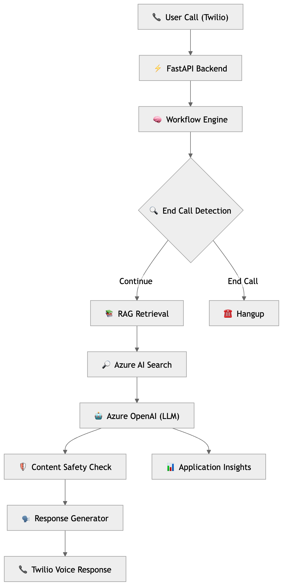
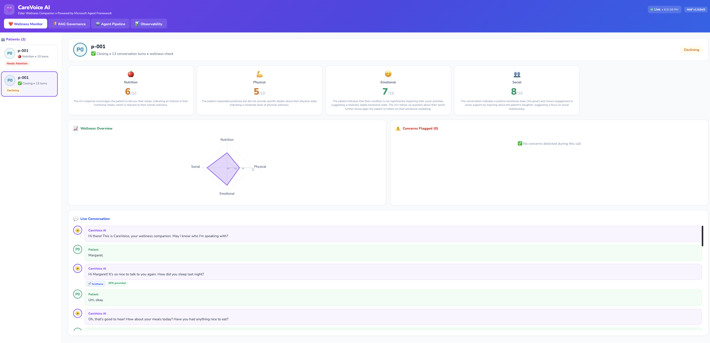
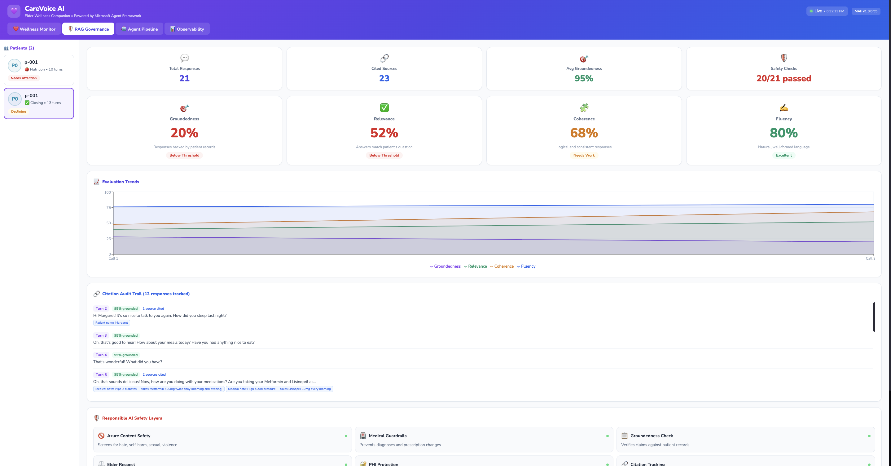
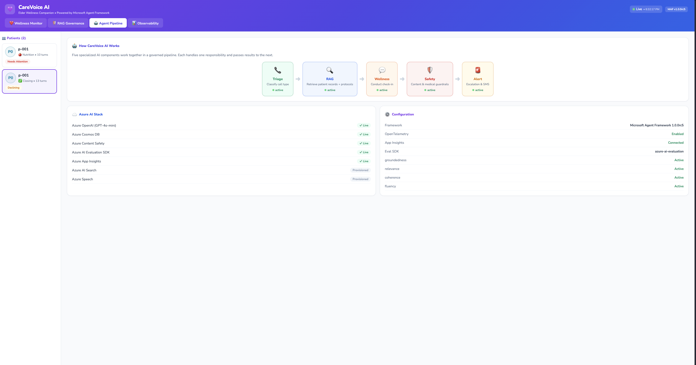
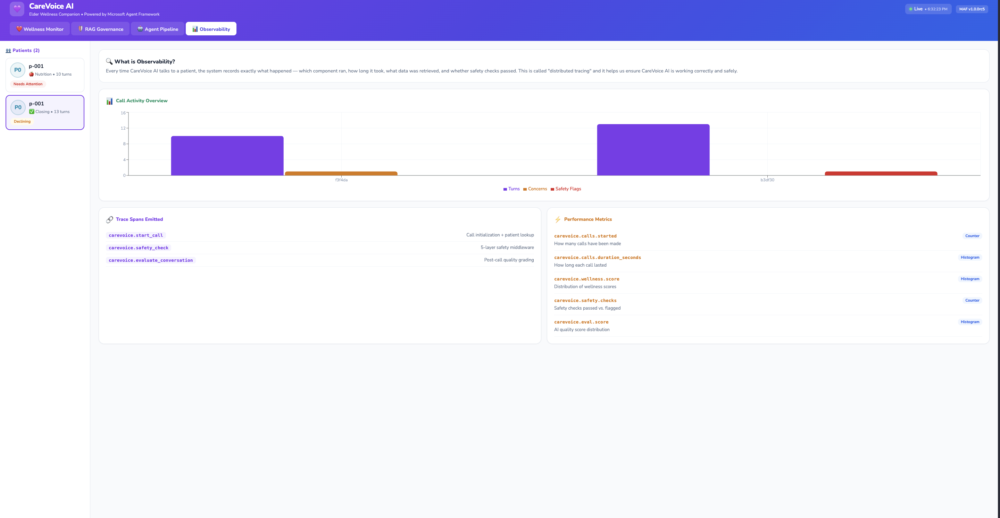

# CareVoice AI — Governed Voice + RAG System

CareVoice AI is a voice-enabled AI system designed for regulated environments such as healthcare and compliance. It delivers **grounded, safe, and observable conversations** using Retrieval-Augmented Generation (RAG) and Azure-native services.

---

## Overview

CareVoice AI enables real-time wellness conversations with patients through voice while ensuring:

- Responses are grounded in data (RAG)
- Safety checks are enforced on every turn
- System behavior is fully observable
- Outputs are evaluated for quality

The system combines voice interaction, retrieval pipelines, and evaluation frameworks to produce **trustworthy conversational AI**.

---

## Architecture

### Azure Services Integration


### System Flow

> End-to-end system architecture showing voice ingestion, RAG pipeline, safety layer, evaluation, and observability.

---

## System Flow (Actual Implementation)

1. User initiates a call via Twilio
2. Audio is streamed to FastAPI via webhook/WebSocket
3. Patient speech is processed into text
4. System checks for **end-of-call intent (bye / thank you)**
5. Query enters RAG pipeline:
   - Embedding generation (Azure OpenAI)
   - Hybrid retrieval (Azure AI Search)
6. Retrieved context is passed to LLM
7. LLM generates response
8. Azure Content Safety validates output
9. Response returned via Twilio voice
10. OpenTelemetry logs traces and metrics
11. Post-call evaluation computes LLM quality metrics

---

## Technology Stack (Live System)

### Backend

- FastAPI
- Python (async + httpx)

### AI & RAG

- Azure OpenAI (GPT-4o-mini)
- Azure OpenAI Embeddings
- Azure AI Search (hybrid retrieval)

### Voice

- Twilio Voice API
- ConversationRelay (streaming)

### Safety

- Azure AI Content Safety

### Data & Storage

- Azure Cosmos DB (patient + session data)

### Observability

- OpenTelemetry (OTLP exporter)
- Azure Application Insights
- Aspire Dashboard

### Evaluation

- Azure AI Evaluation (`azure-ai-evaluation`)
  - groundedness
  - relevance
  - coherence
  - fluency

### Frontend Dashboard

- React
- Vite
- TypeScript
- Recharts

---

## Dashboard

### Wellness Monitoring



Tracks:

- Nutrition
- Physical
- Emotional
- Social

Includes radar visualization + live transcript

### RAG Governance & Evaluation



- Groundedness, relevance, coherence, fluency
- Citation tracking
- Safety checks

### Pipeline View



- Triage → Retrieval → Response → Safety → Alert
- Currently implemented procedurally

### Observability



- OpenTelemetry traces
- Performance metrics
- Safety + evaluation spans

---

## Key Capabilities

### Retrieval-Augmented Generation (RAG)

- Hybrid retrieval using Azure AI Search
- Responses grounded in data

### Safety Enforcement

- Azure Content Safety on every turn
- Guardrails:
  - Medical advice restriction
  - PHI awareness
  - Groundedness checks

### Observability

- Tracked spans:
  - `carevoice.start_call`
  - `carevoice.handle_utterance`
  - `content_safety_check`
  - `cosmos_lookup`
  - `evaluation_run`

### LLM Evaluation

- Groundedness
- Relevance
- Coherence
- Fluency

### Intelligent Call Termination

Detects:

- "bye"
- "thank you"
- "that's all"
- fuzzy speech like "buh"

Triggers Twilio hang-up.

---

## Project Structure

```
carevoice-ai/
├── backend/
│   ├── main.py
│   ├── agents/
│   ├── api/
│   ├── docs/
│   │   ├── screenshots/
│   │   │   ├── wellness.png
│   │   │   ├── rag.png
│   │   │   ├── pipeline.png
│   │   │   └── observability.png
│   │   ├── carevoiceai-architecture-diagram.png
│   │   └── CareVoice_AI.pptx
│   ├── eval/
│   ├── otel/
│   ├── rag/
│   ├── tools/
│   ├── utils/
│   └── workflows/
├── dashboard/
│   └── src/
│       ├── components/
│       └── charts/
├── .env.example
├── .gitignore
├── docker-compose.yml
└── README.md
```

---

## Running Locally

```bash
# Backend
cd backend
pip install -r requirements.txt
uvicorn main:app --reload
```

```bash
# Dashboard
cd dashboard
npm install
npm run dev
```

---

## Try It Live

CareVoice AI is deployed and ready to call. Experience a real AI wellness check-in conversation.

**Call: 1-866-505-5395**

### How it works

1. Dial **1-866-505-5395** from any phone
2. When prompted, say **"Margaret"** — this loads a full patient profile with wellness history from Cosmos DB
3. Have a natural conversation — ask about nutrition, how you're feeling, daily activity, or social connections
4. Say **"bye"** or **"thank you"** to end the call — intelligent call termination handles the rest

> Margaret is a demo senior living alone. The system tracks her wellness across nutrition, physical, emotional, and social dimensions. Every response is grounded in retrieved data, safety-checked by Azure Content Safety, and fully traced in Application Insights.

---
## Design Principles

**Grounded Responses** — Outputs are backed by retrieved data.

**Safety by Default** — All responses pass safety checks.

**Observability First** — Everything is traceable.

**Deterministic Control** — Explicit logic ensures reliability.

---

## Future Enhancements

- Full Microsoft Agent Framework orchestration
- Multi-agent routing
- Personalization memory
- Clinician escalation
- Improved evaluation pipeline

---

## Summary

CareVoice AI demonstrates how voice interfaces, RAG pipelines, safety systems, and observability can be combined to build trustworthy and production-ready AI systems for regulated environments.